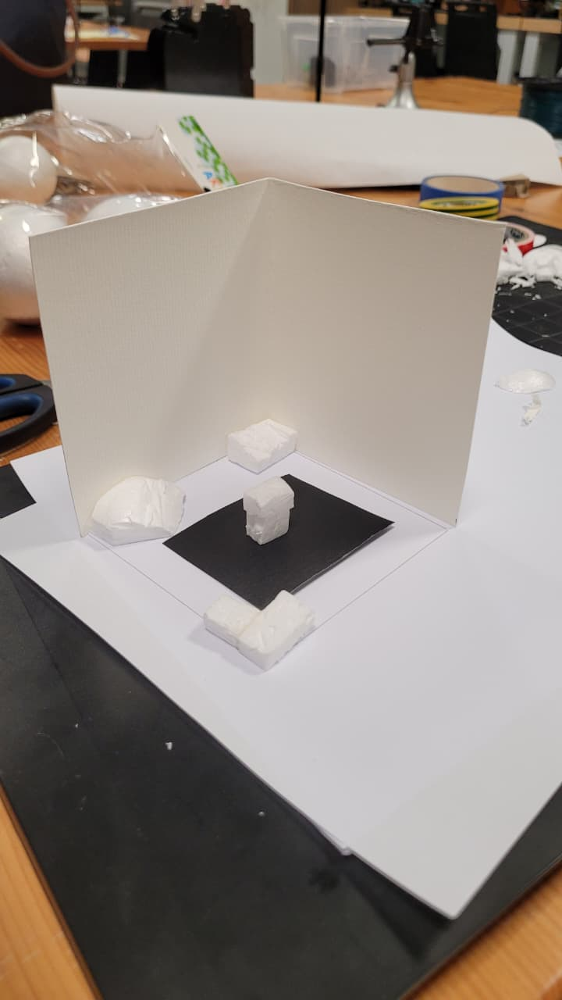

# About Prototype

For this week, I created a simple miniature room using cardboard, paper, and foam. The room includes a few furniture with crude shapes. The main focus of this prototype is to see how the lighting works in a small enclosed space, and prepare an adjustable model for my next prototypes. 

