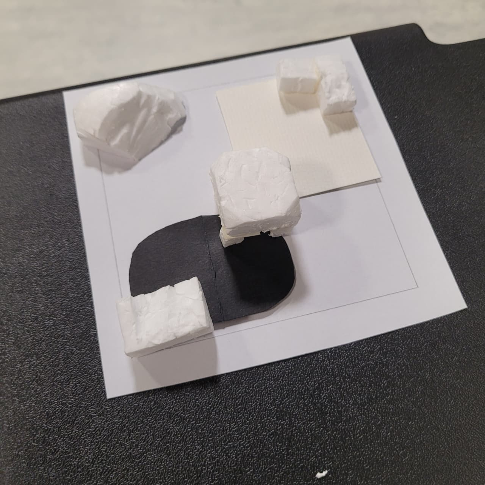

# About Prototype

For this week, I created a simple miniature room using cardboard, paper, and foam. The room includes a few furniture with crude shapes. The main focus of this prototype is to see how the lighting works in a small enclosed space, and prepare an adjustable model for my next prototypes. 

| Layout A | Layout B | Top View |
|:--------:|:--------:|:--------:|
|  |  |  |

# Process

Initially, I wanted to create a fully fledged room with scaled furniture and detailed decorations. However, I realized that it would take too much time to create and I wasn't sure whether it would be functional the way I wanted it to be. In addition, there is only a limited amount of foam in the IM Lab so I had to be clever in using the materials. Therefore, I decided to create a simple room with crude furniture shapes and focus on the lighting aspect.

**Why the lighting?** Since our project will mainly focus on using lights, whether it is projection mapping or LED lights, I needed a miniature model where I can test these things out without having the hustle of creating a full scale room. Second, this prototype is a "testing the water" kind of prototype, where I can experiment with different layouts and materials. Scouring the materials in IM Lab was also pretty difficult, plus I could not store it in the lab and retrieve it later because the lab opens after seminar hours.

> So I had to make do with what I have and create a model that is easy to assemble and disassemble

# Artistic Inspiration

For this prototype, I took inspiration from the works of [Diller Scofidio + Renfro](https://dsrny.com/project/restless-architecture?index=false&section=projects&tags=installation) installation particularly their "Restless Architecture" project. 

    

The project showcases architecture from the 1930s to the present organized into four categories: *mobile, adaptive, operable, and eco-dynamic*. The exhibition features little known projects for which mobility plays a key role in challenging institutional conventions, as well as paradigm-shifting projects by established figures such as Cedric Price, Kisho Kurakawa, Hans Hollein, Maurizio Sacripanti, and OMA.

> **Embodying this experience, my prototype takes on the modeling while bringing in a new aspect: lighting**. 

    

The room is designed to be a small, enclosed space that can be easily manipulated and adjusted. The furniture is simple and crude, but it serves its purpose in creating a functional space. The lighting is the main focus of the prototype, and as the project progresses, I will be able to test different lighting techniques and see how they affect the overall ambiance of the room.

# Next Steps

Having built a physical model, the next step that I would like to do is to create the projection mapping content. I will be using TouchDesigner to create the content, and I will be experimenting with different techniques such as generative art, video mapping, and interactive elements. The plan is to meet with my partner and discuss the generation from his side and link it up with the application.

## Extra Resources

[Cliff Tan Modeling](https://www.scmp.com/lifestyle/health-wellness/article/3270502/viral-tiktok-videos-singaporean-architect-bring-feng-shui-whole-new-audience)
