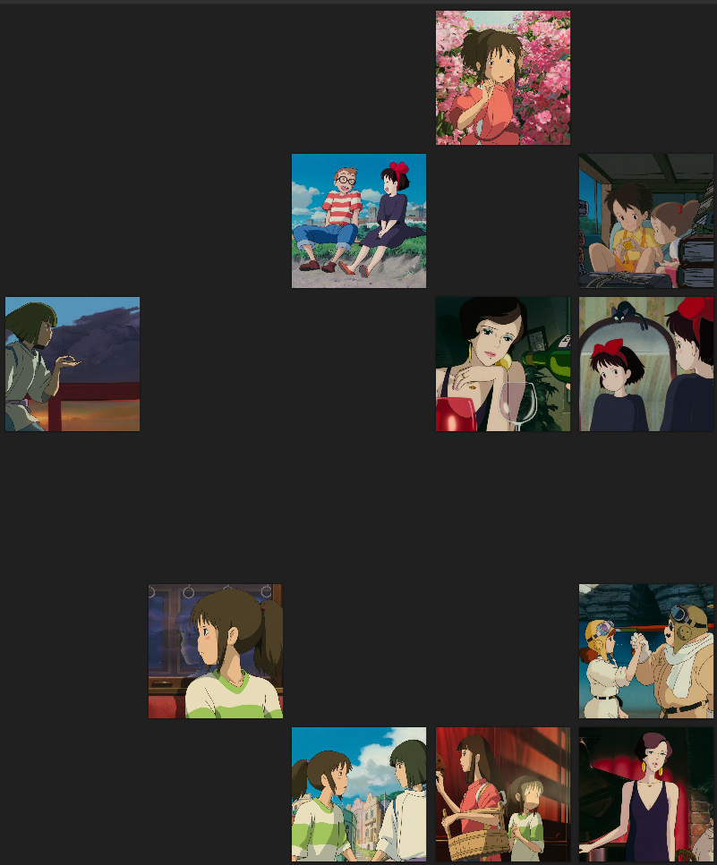

Written by Ahmad Dahlan Hafizh

# Prologue 

Recently, in March and April, we have seen the rise of Ghibli-style AI generated images circulate within the internet. Controversies rose amidst the trend, highlighting that these images violate Studio Ghibli's intellectual property (their animes). On one side, using AI to generate 'Ghibli' stylized images pay no respect to the animators, producers, and everyone involved that has poured their tears and sweat to create beautiful animations. On the other, these images were generated 'for fun' and would not reflect any ill intentions behind it.

> Computer vision decodes to interpret and convey encoded messages in digital images. At the same time, computational methods are created by people and are therefore not outside of cultural, social, and historical ways of seeing and practices of looking. 
> *Arnold & Tilton, Distant Viewing: Theory p. 26*

As we have been studying for a whole semester with AI tools, I wish to gain an insight to this event. Distant Viewing Theory argues that observing computational vision interpretation is a double-way to the humans themselves, in other words, by using AI, we also learn how the machine itself works (how it was trained, what it was trained with, and who trained it). 

# Methodology

### Snapshotting Ghibli 
The first question that I ask when doing this project is simple:

> **"How do I obtain the Ghibli Movie Frames?"**

Manually 'screenshotting' frames would be a bad idea. Initially, I was going to use FFMPEG to automate capturing and extracting frames (tutorial [here](https://shotstack.io/learn/ffmpeg-extract-frames/)). But this method itself begs the question, *how would I obtain the video file? What if the captured frames are too many (thousands?) What if some of them are duplicates, blurs, or bad?*

While technically I could obtain it through 'interesting' ways, I figured it would be best to try scour the internet to see if there are potential answers. Fortunately, I found a user on Imgur ([Loonnn](https://imgur.com/user/Loonnn)) who passionately captured around 50 beautiful frames for each Ghibli movies. In addition, we are able to download a .zipped file of all the images a user has uploaded in Imgur. The following are the movies listed and a short loglines from IMDb:

 - **Spirited Away (2001)**
	 - During her family's move to the suburbs, a sullen 10-year-old girl wanders into a world ruled by gods, witches and spirits, and where humans are changed into beasts. 
 - **Princess Mononoke (1997)**
	 - While seeking to cure himself of a curse, young warrior Ashitaka stumbles into a conflict between the people of Iron Town and Princess Mononoke, a girl raised by wolves, who will stop at nothing to prevent the destruction of her home.
 - **Porco Rosso (1992)**
	 - In 1930s Italy, a veteran World War I pilot is cursed to look like an anthropomorphic pig.
 - **My Neighbor Totoro (1988)**
	 - When two girls move to the country to be near their ailing mother, they have adventures with the wondrous forest spirits who live nearby.
 - **Kiki's Delivery Service (1989)**
	 - Along with her black cat Jiji, Kiki settles in a seaside town and starts a high-flying delivery service. Here begins her magical encounter with independence and responsibility, making lifelong friends and finding her place in the world.
 - **Castle in the Sky (1986)**
	 - Pazu's life changes when he meets Sheeta, a girl whom pirates are chasing for her crystal amulet, which has the potential to locate Laputa, a legendary castle floating in the sky.
 - **Lupin III: The Castle of Cagliostro (1979)**
	 - A dashing thief, his gang of desperadoes and an intrepid cop struggle to free a princess from an evil count, and learn the secret of a treasure that she holds part of the key to.

The methodologies how Loonnn obtained these frames are unclear. However, thanks to them, we are able to use it for the sake of study. In total, there are 310 frames of Ghibli movies which provides me a corpus large enough for this study. 

### Do AI(s) Dream of Animated Sheep? 
The first tool that I am using is **Distant Viewing Explorer**. It is a free, open-source web tool that allows users to apply advanced AI models to visual and multimodal datasets without needing extensive programming skills. The tool simplifies access to computer vision technologies and supports working with both small and large datasets.

Within DVE, there are sub-sections of several models that grouped by the type of data that they work with. For this experiment, I am using **Object Detection, Image Segmentation, and Multimodal Zero-Shot Model.** The first two categories fall under Image section, where it uses Microsoft COCO (Common Objects in Context), a large-scale dataset designed to advance object recognition and scene understanding. The zero-shot model uses Sigmoid Loss for Language-Image Pre-training (SigLIP), which essentially combines image-text abilities to understand images (pre-trained) and texts (to read and interpret). 

The second tool that I am using is **Orange Data Mining** an open-source data visualization, machine learning and data mining toolkit. It features a visual programming front-end for exploratory qualitative data analysis and interactive data visualization. This tool was trained using Google's Inception v3 model, a neural network architecture for image classification.

# Outcomes

### DVE | Object Detection

The following are results taken from Lupin III: The Castle of Cagliostro. I did the test 2-3 times to see if there could be any changes in the result, but apparently the model seems to be consistent in its answers.

| Image                                                         | Description                                                                              |
| ------------------------------------------------------------- | ---------------------------------------------------------------------------------------- |
|  | It recognizes chair, but not the window, or the person next to it.                       |
|  | Successfully recognized bench, but not table, nor the fences                             |
|  | Suprisingly, it got clock and two persons correctly                                      |
|    | It thinks that the castle is a boat. Perhaps because it is surrounded by waters          |
|      | Sadly, this is completely wrong. Could have guessed fountains, or even ruins.            |
|      | It is able to recognize an object as small as a tie, but not the large person wearing it |

### DVE | Image Segmentation

For image segmentation, I used frames from My Neighbor Totoro. The reason I use this film was because there is a clear distinction in most of the scenes (i.e sky, ground, trees, house, etc.) If the model pass this test, then I assume we could use other images that are more difficult. 

| Original & Segments                                                    |
| ---------------------------------------------------------------------- |
|    |
|  |

Since the model was able to distinct section of a scenery, I also tried several scenes from Spirited Away which were slightly more abstract than My Neighbor Totoro scenes. Sadly, the computer was not able to distinguish between buildings and people mixed in together. 

### DVE | Zero-Shot Model 

For this multimodal, I am unsure which material to use. For simplicity's sake, I use the frames from Kiki's Delivery Service, which I believe contains scenes that reflect our cities, nature, and people quite well. The results are unsurprising that the model was able to recognize most of the 'context' within the images well.

| 'City'                                                                                                            | 'House'                                                                       | 'Person'                                                          |
| ----------------------------------------------------------------------------------------------------------------- | ----------------------------------------------------------------------------- | ----------------------------------------------------------------- |
|                                                    |              |  |
| The first 10 or so pictures go it right, there are features of a city such as tall buildings, streets, cars, etc. | I am surprised it chose the interior of a house rather than the external form | It got the pictures right, nice job!                              |

### Orange Data Mining

With Orange, I split my process into two parts. The first part consisted of using an unsorted, uncategorized corpus, meaning all 300+ images are inside a single folder. The latter being a categorized corpus based off five categories:

 1. **Creatures** → Images with non-human, non-machine beings in them
 2. **Humans** → Images with only humans
 3. **Machines** → Images with machinery, robots, or some mix between the two
 4. **Nature** → Images with trees, mountains, and overall 'greens' in them
 5. **Scenery** → Images that may contain nature, buildings, cities, but overall not nature. These categories will help me determine the Confusion Matrix later on. 

**Part One: Uncategorized Corpus** 

| Image                                                                         | Description                                                                                                                                                                                                        |
| ----------------------------------------------------------------------------- | ------------------------------------------------------------------------------------------------------------------------------------------------------------------------------------------------------------------ |
|      | Based on the output, what I can conclude is that the left-axis recognizes nature images, whereas the right-axis typically recognizes humans, although there are scenery, machines, and creatures mixed in between. |
|  | I did a selection from the cluster to see on a detailed view. From what I learn, it seems to recognize similar looking pictures of creatures / monsters despite being from different movies.                       |

**Part Two: Categorized Corpus** 
In this part, I wanted to experiment by trying to uncover 'how' the model thinks when classifying the images. What I found interesting is that the model agrees with three categories: *Nature, Scenery, and Machines.* On the other hand, it seems to fail on figuring out the difference between a person and a creature. 

| Image                                                                    | Description                                                                                                                                                                    |
| ------------------------------------------------------------------------ | ------------------------------------------------------------------------------------------------------------------------------------------------------------------------------ |
|     | After sorting around 100 images (based on my selection), here are the sorted, looking more clean and structured.                                                               |
|      | All the correct images the model is able to recognize based on the set categories                                                                                              |
|  | It seems that the model got confused between creatures and humans. Now that I look at it, some pictures does have humans in them, although overshadowed by (larger) creatures. |
|        | The model is able to recognize all human pictures well. I suspect it is influenced by paintings with human subject in them, bearing similarities within.                       |
|    | There's a lot of gaps, but overall I think it did pretty well on agreeing what machines are?                                                                                   |
|        | All greens, nice!                                                                                                                                                              |
|      | Yes. I agree these are sceneries as well                                                                                                                                       |

# Discussions, Findings, and Conclusion

While working on this project, I noticed several things on the way AI models recognize anime pictures. I want to highlight shapes (two-dimensional representation, built using lines, textures, or colours) and forms (likely three-dimensional as it has depth, elements of art, principles of design, and media). Why is this important? Because from some of the examples above, it can be summarized that the model recognizes shapes more than forms. 

> **Take the image from Castle of Cagliostro (DVE, Object Detection), the AI recognizes clocks, ties, but not windows, nor castles, or some people (it mistook as a boat, perhaps by also looking its position in waters).**

Similarly, Inception v3 can distinguish nature, scenery, images relatively well, because I suspect their dataset was trained on paintings (perhaps those renaissance nature paintings). The colors, shapes elements, in the pictures were easily recognized by the model, hence it was able to predict those judging by the confusion matrix. 

So, what does this tell us? Think back about the problem that we presented in the beginning: Ghibli style AI-generated images circulating in the internet. To be able to recognize an image, and then converting it to another style means that the model has to understand both images firsthand. This also means, that it was trained using Ghibli images. If such is the case, *how were those companies obtain the images?* Ultimately, this project asks about our morality when developing AI. As a tool,  it emphasizes our nature by million-fold. Depending on our intentions, it can multiply good or evil, and we are the ones that decide our future and fate. 

# Resources

- Arnold, T., & Tilton, L. (2023). Downloaded from. _The MIT Press_. https://doi.org/10.7551/mitpress/14046.001.0001

- Lin, T.-Y., Maire, M., Belongie, S., Bourdev, L., Girshick, R., Hays, J., Perona, P., Ramanan, D., Zitnick, C., & Dollár, P. (2015). _Microsoft COCO: Common Objects in Context_. https://arxiv.org/pdf/1405.0312

- Loonnn. (2025). _Loonnn Imgur Profile_. Imgur. https://imgur.com/user/Loonnn

- O’Brien, M., & Parvini, S. (2025, March 27). _ChatGPT’s viral Studio Ghibli-style images highlight AI copyright concerns_. AP News. https://apnews.com/article/studio-ghibli-chatgpt-images-hayao-miyazaki-openai-0f4cb487ec3042dd5b43ad47879b91f4

- Q, H. (2025, March 28). _My Experience with Studio Ghibli Style AI Art: Ethical Debates in the GPT-4o Era_. Medium. https://medium.com/@haileyq/my-experience-with-studio-ghibli-style-ai-art-ethical-debates-in-the-gpt-4o-era-b84e5a24cb60